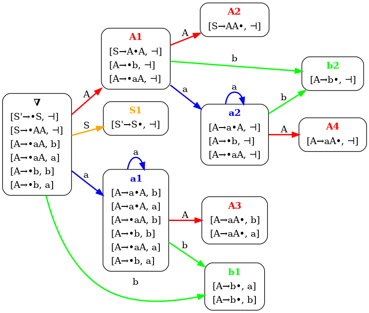
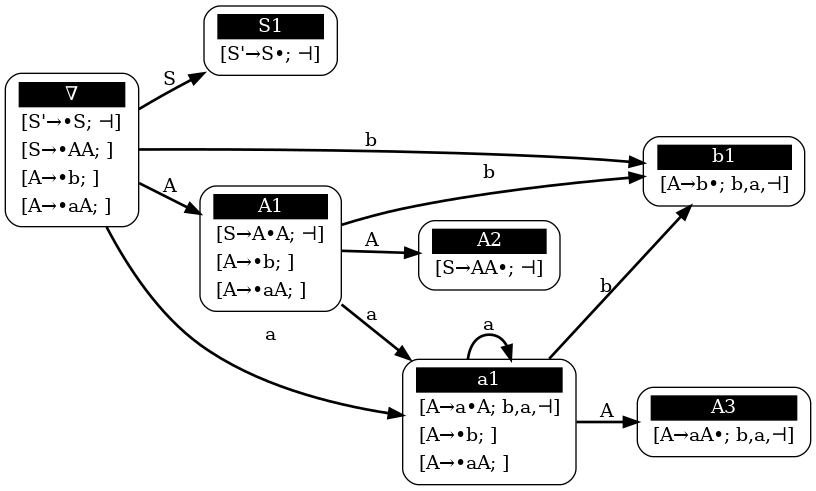

# LRVIZ
Веб приложение, предоставляющее API и веб-интерфейс для изучения алгоритмов построения LR-автоматов.

## Примеры визуализации

Ниже представлен LR(1)-автомат, построенный для грамматики:

```
S -> AA
A -> aA | b
```



Лог построения этого автомата:

```
[0] COMMENT buildLrAutomaton: Построим LR-автомат lr(1)
[1] COMMENT extendGrammar: Расширяем исходную грамматику.
[2] ACTION addState: Добавляем состояние '∇'.
...
[58] ACTION addTransition: Добавляем переход из состояния 'a2' в состояние 'a2' по символу 'a'.
[59] COMMENT startAddNewTransitions: Просматриваем состояние 'A3'
[60] COMMENT startAddNewTransitions: Просматриваем состояние 'A4'
```

LALR-автомат, построенный по той же грамматике:



## Сборка

Чтобы собрать программу, нужно предварительно установить:

- [JDK 25](https://jdk.java.net/25/)
- [Apache Maven](https://maven.apache.org/download.cgi)

```bash
git clone git@github.com:Fenya2/lrviz.git
cd lrviz
mvn package
```

После успешной сборки исполняемый jar-файл будет находиться в директории `target/`.

## Запуск

Для экспорта изображений графов на сервере должен быть установлен пакет [Graphviz](https://graphviz.org/).

```bash
sudo apt install graphviz
```

Приложение запускается следующей командой:

```bash
java -jar PATH_TO_APP
```

где PATH_TO_APP - путь к исполняемому jar-файлу приложения

> [!NOTE]
> jar-файл приложения можно [собрать самостоятельно](#сборка) или же
> загрузить [со страницы релизов приложения](https://github.com/Fenya2/lrviz/releases)

## Использование

По умолчанию запущенное приложение доступно из браузера по адресу http://localhost:8080.

Веб-интерфейс приложения представляет собой SPA-приложение, использующее REST API. Документация к API находится на
странице http://localhost:8080/api/docs/guide.html.

> [!NOTE]
> Также приложение развернуто в публичной сети и доступно по адресу https://llr.su.

## Контакты

При возникновении вопросов можно создать issue или связаться со мной:

- *Email:* [fenya74.09@gmail.com](mailto:fenya74.09@gmail.com)
- *Telegram:* [@fenya00](https://t.me/fenya00)